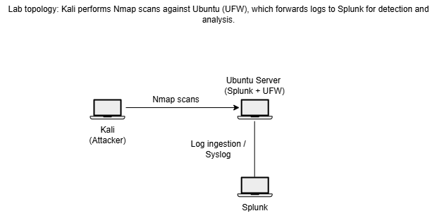

# 🛡️ Enterprise Security Monitoring: Automated Port Scan Detection Lab
An enterprise-grade Security Operations Center (SOC) simulation lab demonstrating end-to-end security log ingestion, parsing, correlation, and automated alert engineering using Splunk Enterprise and Linux Netfilter infrastructure.

---

## 📌 Project Overview
This project serves as a functional demonstration of defensive engineering capabilities, showcasing how a Security Analyst designs infrastructure to detect malicious reconnaissance phases (Nmap targeting) through structured firewall logs (`Uncomplicated Firewall - UFW`).

* **Target Objective:** Minimize Time-to-Detection (TTD) for adversarial port sweeping, network scanning, and footprinting activities.
* **Core Framework:** Aligned with **MITRE ATT&CK Matrix T1046 (Network Service Discovery)**.

---

## 🏗️ Architectural Topology & Environment
The infrastructure is hosted in a dedicated, isolated virtualization environment designed to mimic a demilitarized zone (DMZ) segment.



### Technology Stack
* **SIEM Core:** Splunk Enterprise (Log Ingestion, Custom Source-Typing, Search Processing Language - SPL)
* **Log Producer:** Ubuntu Server Linux (Kernel Netfilter via `UFW` Logging Engine)
* **Adversarial Emulator:** Kali Linux (Utilizing Advanced `Nmap` Suite Options)
* **Transport Protocol:** Standard Local Syslog Daemon Configuration

---

## 📁 Repository Directory Structure

```text
├── alerts/                
├── dashboards/            
├── detections/          
├── images/                
└── nmap-commands/        
```

---

## 🔍 Technical Implementation Matrix

### 1. Adversarial Emulation Framework (`/nmap-commands`)
To baseline and validate detection efficacy, a variety of scanning profiles were executed targeting the production Linux host:
* **TCP Connect Scanning (`-sT`):** Simulates standard full-handshake connection mapping.
* **SYN Stealth Scanning (`-sS`):** Simulates half-open reconnaissance to bypass standard socket layer logging.
* **UDP Scanning (`-sU`):** Validates the system's capacity to audit stateless network events.

### 2. Detection Engineering & SPL Tuning (`/detections`)
Custom Search Processing Language (SPL) profiles were generated to distinguish white-noise infrastructure connections from targeted malicious behavior.
* **Heuristic Profiling:** Designed logic to identify single internal IPs hitting $>100$ distinct ports within a moving 60-second window.
* **Geographic & Structural Parsing:** Custom regex extractions implemented to normalize raw UFW `SRC=`, `DST=`, `SPT=`, and `DPT=` logs into structured fields.

### 3. Tactical Operational Dashboards (`/dashboards`)
The repository contains deployment-ready XML configurations to power SOC analytical dashboards tracking:
* **Top Attacked Interfaces** & Destination Port Distributions.
* **Volume Delta Indicators:** Sudden spikes in firewall drop actions relative to standard historic baseline metrics.

### 4. Alerting & Threshold Optimization (`/alerts`)
To optimize the Signal-to-Noise Ratio (SNR) in production environments, alerts are configured with strict deduplication properties:
* **Throttle Rule:** Suppress consecutive identical source-IP alerts for a 15-minute window following the initial trigger to eliminate alert fatigue.

---

## 🚀 Key Learning Deliverables & Professional Competencies
Through engineering this framework, the following operational competencies were refined:
* **Deep Packet & Log Comprehension:** Detailed expertise in identifying Netfilter kernel log patterns (`BLOCK`, `DROP`, `ALLOW`).
* **SIEM Engineering Excellence:** Practical mastery of writing clean, high-performance SPL queries optimized for high-volume indexing pipelines.
* **False Positive Reduction:** Architecting defensive mechanisms that filter out standard internal corporate monitoring scans from actual external threats.
